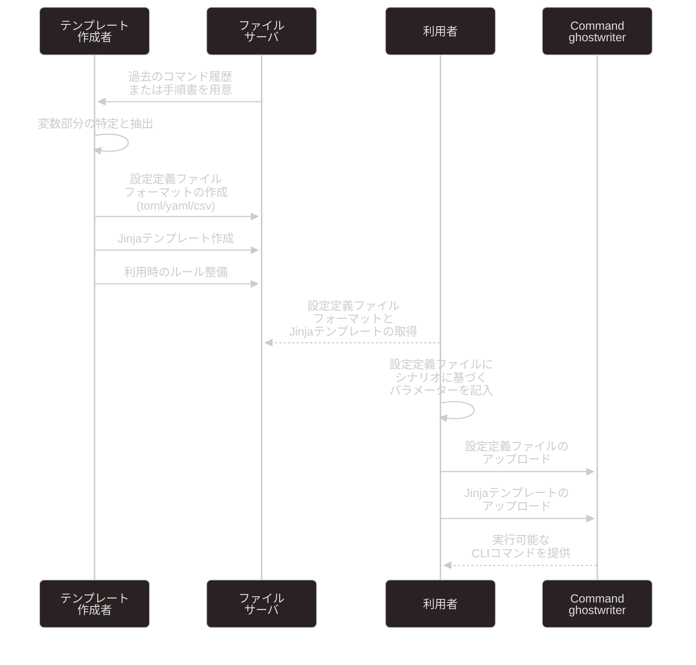

<div align="center">

[![streamlit][streamlit-img]](https://streamlit.io/)
[![build status][build-img]][build-link]
[![codecov][codecov-img]][codecov-link]
[![License: MIT][license-img]][license-link]

</div>

# Welcome to Command ghostwriter
このアプリケーションは、IaCをはじめ自動化ツール導入が困難なインフラ運用現場において、CLIによる形式的な運用作業を効率化するソリューションです。

繰り返しが多くなりがちなCLI実行コマンドを、設定定義ファイル(csv/yaml/toml)とJinjaテンプレートファイルの2つに分けて記述することで、設定定義ファイルの変更のみでCLIコマンドが生成できます。また、コマンドに留まらず、Markdownによる作業手順書の生成にも対応しています。

## 目次
1. [Quick Start](#quick-start)
2. [使い方の流れ](#使い方の流れ)
3. [テンプレート化の手順](#テンプレート化の手順)
4. [入力ファイルのフォーマット](#入力ファイルのフォーマット)
5. [機能モード](#機能モード)
6. [デバッグ機能](#デバッグ機能)
7. [ユースケース例](#ユースケース例)
8. [制限事項と注意点](#制限事項と注意点)
9. [高度な機能](#高度な機能)
10. [開発者向けドキュメント](#開発者向けドキュメント)

## Quick start

### Windows (amd64)
1. 実行環境のセットアップ (Python, Git)

```ps1
# chocolateyを使う場合
Set-ExecutionPolicy Bypass -Scope Process -Force; iex ((New-Object System.Net.WebClient).DownloadString('https://chocolatey.org/install.ps1'))
choco install python312
choco install git
```

2. Webアプリ本体のセットアップ
```ps1
cd $env:PROGRAMDATA
git clone https://github.com/tvna/streamlit-command-ghostwriter.git
cd streamlit-command-ghostwriter

(Invoke-WebRequest -Uri https://install.python-poetry.org -UseBasicParsing).Content | python -

[System.Environment]::SetEnvironmentVariable('path', $env:APPDATA + "\Python\Scripts;" + [System.Environment]::GetEnvironmentVariable('path', "User"),"User")

poetry install
```

3. 下記のコマンドでWebアプリを起動
```ps1
cd $env:PROGRAMDATA\streamlit-command-ghostwriter
poetry run streamlit app.py
```

まずはサンプルファイルをアップロードして、「CLIコマンド生成」をクリックした結果を確認してみてください。

## 使い方の流れ



## テンプレート化の手順

既存のコマンドやMarkdownをテンプレート化する手順は以下の通りです：

1. **変数部分の特定**
   ```bash
   # 変数化前のコマンド例
   ssh 192.168.1.101 "df -h"
   ssh 192.168.1.102 "df -h"
   ```

2. **設定定義ファイルの作成**
   ```yaml
   servers:
     - ip: 192.168.1.101
     - ip: 192.168.1.102
   commands:
     disk_check: df -h
   ```

3. **Jinjaテンプレートの作成**
   ```jinja
   
   ssh {{ server.ip }} "{{ commands.disk_check }}"
   
   ```

4. **動作確認**
   - Visual Debugモードで変数の展開を確認
   - エラーがある場合は設定定義ファイルまたはテンプレートを修正

## 入力ファイルのフォーマット

### 設定定義ファイル
設定定義ファイルは、CSV/YAML/TOMLのいずれかの形式で記述できます。これらのファイルには、コマンドやドキュメントの生成に必要な変数を定義します。

#### YAML形式の例
```yaml
servers:
  - hostname: web01
    ip: 192.168.1.101
    role: web
  - hostname: db01
    ip: 192.168.1.102
    role: database
commands:
  check_disk: df -h
  check_memory: free -m
```

#### TOML形式の例
```toml
[servers.web01]
hostname = "web01"
ip = "192.168.1.101"
role = "web"

[servers.db01]
hostname = "db01"
ip = "192.168.1.102"
role = "database"

[commands]
check_disk = "df -h"
check_memory = "free -m"
```

#### CSV形式の例
```csv
hostname,ip,role,command
web01,192.168.1.101,web,df -h
db01,192.168.1.102,database,free -m
```

### Jinjaテンプレートファイル
Jinjaテンプレートファイルは、設定定義ファイルの変数を参照してコマンドや文書を生成するためのテンプレートです。

#### コマンド生成用テンプレートの例
```jinja

# {{ server.hostname }} ({{ server.role }})
ssh {{ server.ip }} "{{ commands.check_disk }}"
ssh {{ server.ip }} "{{ commands.check_memory }}"

```

#### Markdown生成用テンプレートの例
```jinja
# サーバー監視手順書


## {{ server.hostname }}

### 基本情報
- ホスト名: {{ server.hostname }}
- IP アドレス: {{ server.ip }}
- 役割: {{ server.role }}

### CLIコマンド
{{ commands.check_disk }}
{{ commands.check_memory }}


```

## 機能モード

### CLIコマンド生成モード
設定定義ファイルとJinjaテンプレートから、実行可能なCLIコマンドを生成します。

- 変数は `{{ 変数名 }}` の形式で参照
- 制御構文（for, if等）は `` で囲んで記述
- 生成されたコマンドはそのままコピー＆ペーストで実行可能

### Markdown生成モード
設定定義ファイルとJinjaテンプレートから、Markdown形式の文書を生成します。

- 標準的なMarkdown記法をサポート
- コードブロックの言語指定が可能
- テーブル形式での出力に対応
- 画像の参照にも対応

## デバッグ機能

### Visual Debug
テンプレートの解析結果を視覚的に確認できます。

- 変数の展開結果の確認
- テンプレート構文のエラーチェック
- 制御構文の実行フローの確認

### TOML/YAML Debug
設定定義ファイルの解析結果を確認できます。

- パース結果の構造化表示
- データ型の確認
- 構文エラーの詳細表示

## ユースケース例

### PowerShellコマンド生成
```jinja

Get-Service -Name "{{ service.name }}" | Select-Object Name, Status

```

### Linuxコマンド生成
```jinja

tar -czf {{ file.name }}.tar.gz {{ file.path }}

```

## 制限事項と注意点

### 入力ファイル
- ファイルサイズ: 最大30MB
- 文字エンコーディング: UTF-8,Shift_JIS,EUC-JPのみテスト済み
- 改行コード: LF/CRLF両対応

### セキュリティ
- 生成されたコマンドは実行前に必ず内容を確認してください

### 既知の制限事項
- 一部の特殊文字はエスケープが必要
- テンプレートにおけるネストされたループは非推奨

## 高度な機能

### カスタムテンプレート
独自のテンプレートを作成して利用できます。

- Jinjaの標準フィルターをサポート
- カスタムフィルターの追加も可能
- 複数テンプレートの組み合わせに対応

## 開発者向けドキュメント

開発に必要なコマンド集は[こちら](assets/docs/commands.md)を参照してください。

[streamlit-img]: https://img.shields.io/badge/-Streamlit-FF4B4B?style=flat&logo=streamlit&logoColor=white
[streamlit-cloud-img]: https://static.streamlit.io/badges/streamlit_badge_black_white.svg
[streamlit-cloud-link]: https://command-ghostwriter.streamlit.app/
[build-link]: https://github.com/tvna/command-ghostwriter/actions/workflows/test-and-build-on-merged.yml
[build-img]: https://github.com/tvna/command-ghostwriter/actions/workflows/test-and-build-on-merged.yml/badge.svg?branch=main&event=push
[codecov-link]: https://codecov.io/gh/tvna/command-ghostwriter
[codecov-img]: https://codecov.io/gh/tvna/command-ghostwriter/graph/badge.svg?token=I2LDXQHXB5
[license-link]: https://github.com/tvna/streamlit-command-ghostwriter/blob/main/LICENSE
[license-img]: https://img.shields.io/badge/license-MIT-blue
